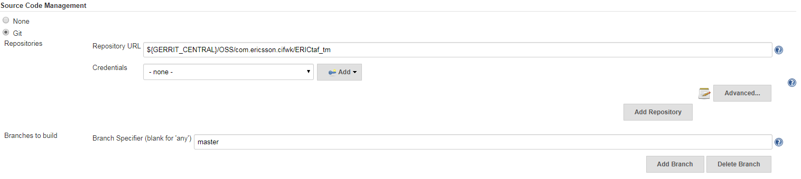
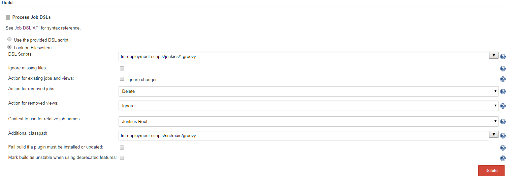

# Prerequisites

## Global Environment Variables
Note: The seed job expects some Global Environment Variables to be present on jenkins

| Name | Value |
| ------------ | ----------------------------------------------- |
| *GERRIT_CENTRAL* | ssh://gerrit.ericsson.se:29418 |
| *GERRIT_MIRROR* | ssh://gerritmirror.lmera.ericsson.se:29418 |

## Seed Job

In order to create all required jobs for "TMS" project
 - Manually create a freestyle job, the name does not matter.
 - Edit the job configuration and scroll down the the "Source Control Management" section and enter the TMS repo details.
 
 - Scroll down to the "Build" section and  add a "Process Job DSLs" build step
 - Select the "Look on Filesystem" option and paste "tm-deployment-scripts/jenkins/*.groovy" in the "DSL Scripts" textbox.
 - Click on the "Advanced" button and paste "tm-deployment-scripts/src/main/groovy" in the "Additional classpath" textbox
 
 - Save the configuration and run the job

Once the job runs it automatically creates all the required jobs for the Test Management System project.

## Database backup and restore jobs
Database backup job requires mysqldump to be installed on slaves.
Database restore job requires mysql to be installed on slaves.

##Smoke Test Configuration
* JDK:1.8

* Label: RHEL 6.4

* SCM: Git
  * repo (mirror)
  * clean before checkout

* MAVEN:
  * version: 3.0.5
  *goal: -U clean package -Psmoke -pl :tm-tests -amd -Dmaven.test.failure.ignore=false -Dtaf.profiles=stage -Dsuitethreadpoolsize=8

* Publish Actions: Publish TestNG Results
 * **/test-output/testng-results.xml

* Allow broken build claiming